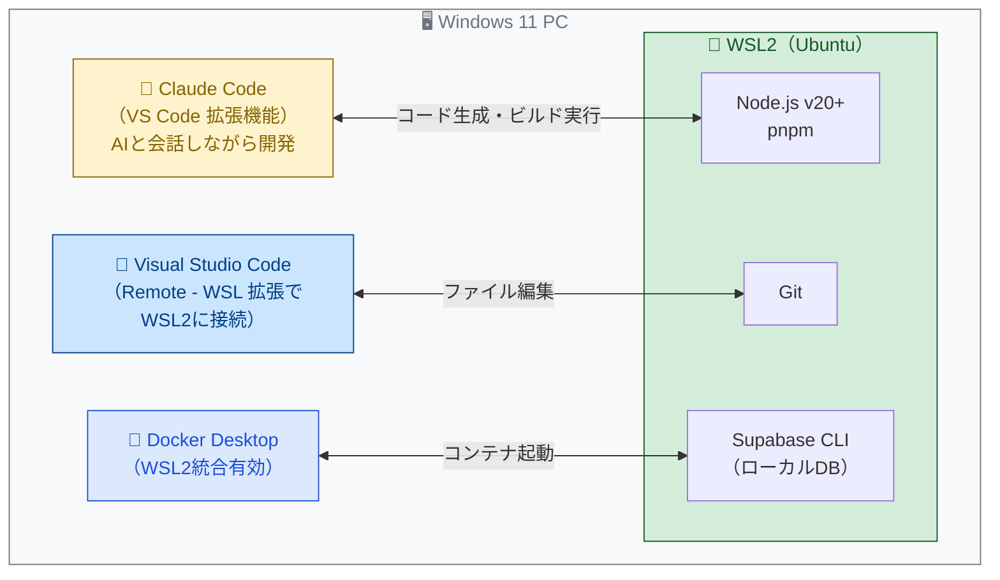
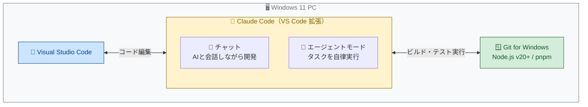
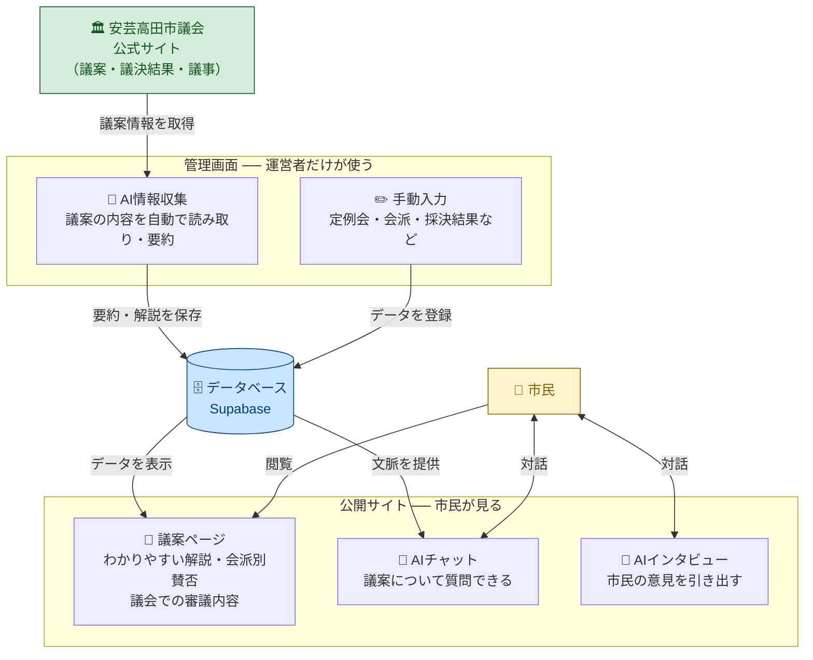
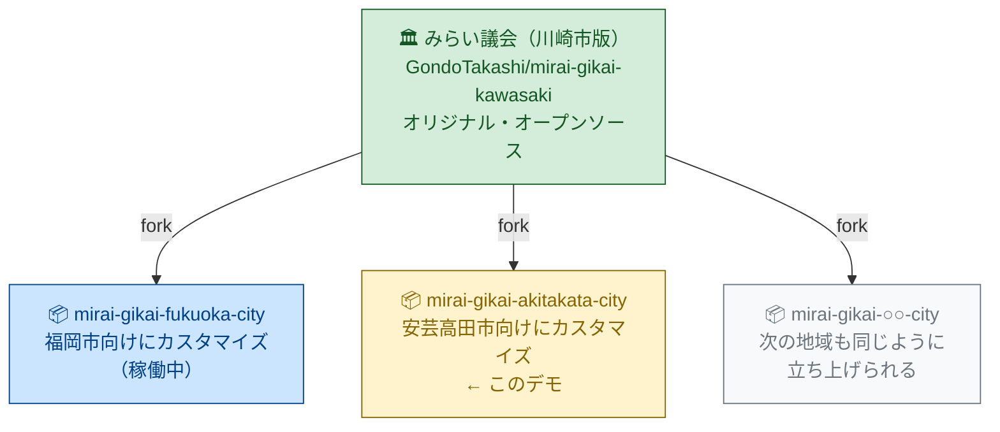
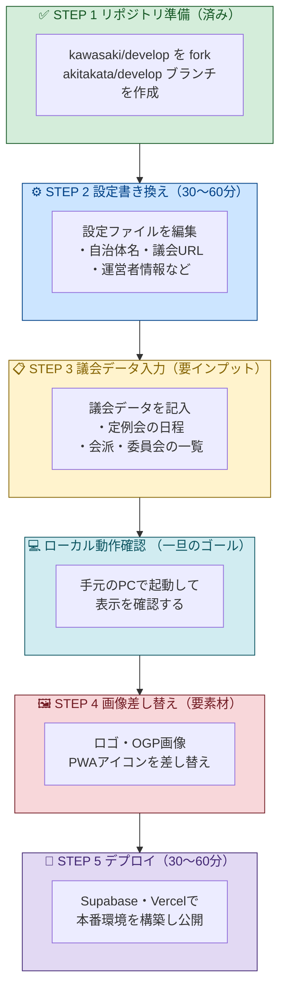
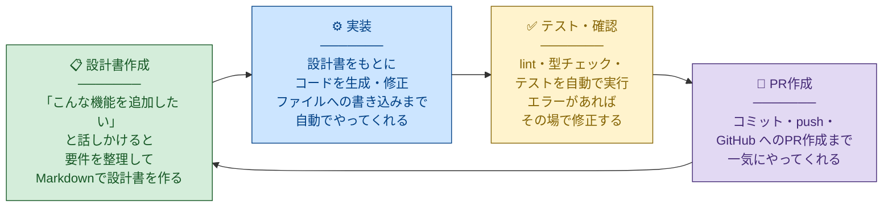

# みらい議会 安芸高田市版 デモ用レクチャー資料

> 作成日: 2026-04-11
> 対象: デモ参加者・今後の導入検討者

---

## このデモで伝えたいこと

「みらい議会」は、地方議会の議案情報を市民にわかりやすく届けるためのオープンソースサービスです。
川崎市版をベースに、**どんな自治体でも比較的短時間でカスタマイズして立ち上げられる**ことを、安芸高田市を例にリアルタイムで実演します。

---

## 1. バイブコーディングとは？

### バイブコーディングの考え方

**バイブコーディング（Vibe Coding）** とは、AI に自然な言葉で意図を伝えながらソフトウェアを作るスタイルの開発です。
コードを一行一行書く代わりに、「こういうものを作りたい」「ここを直してほしい」と話しかけると AI が実装してくれます。

このデモ自体も、Claude Code を使いながらリアルタイムで進めます。

### 開発環境の選択肢

バイブコーディングに使えるツールはいくつかあります。環境に合わせて選んでください。

**① WSL2 ＋ VS Code ＋ Claude Code（このデモ）**



> Supabase CLI・シェルスクリプトが最も安定して動く構成です。

---

**② Git for Windows ＋ VS Code ＋ Claude Code**



> WSL2 なしで動かせます。Supabase をローカルで使わずクラウド（Supabase Studio）で管理する場合に適しています。

---

**③ Antigravity（Google）**

Antigrabity使っっている詳しい方別途お願いします＞＜。

> Google Gemini が AI を担当します。Node.js / pnpm / Git は別途インストールが必要です。Supabase CLI をローカルで使う場合は追加セットアップが必要になります。

| | ① WSL2 ＋ Claude Code | ② Git for Windows ＋ Claude Code |
|---|---|---|
| OS | Windows ＋ WSL2 | Windows のみ |
| AI | Claude（Anthropic） | Claude（Anthropic） |
| セットアップ | やや手間かかる | 比較的かんたん |
| Supabase CLI | ○ 安定して動く | ○ Windows版あり |
| ローカルDB起動 | ○ 安定して動く | △ クラウドの Supabase が別途必要 |
| このデモでの使用 | **◎ これを使用** | — |

> **WSL2 を選ぶ理由**: ローカルDBの起動（`supabase start`）が最も安定して動作するためです。
> **②で十分なケース**: ローカルで Supabase を動かさずクラウド（Supabase Studio）に繋ぐ運用であれば Git for Windows のみで問題なく進められます。

---

## 2. みらい議会とは？

### できること
- 議会で審議されている議案をわかりやすく解説
- AIとチャットで議案の内容を質問できる
- 議員との質疑応答（議会での審議）を見られる
- 会派別の賛否を確認できる

### C. サービスの仕組み図



すでに川崎市・福岡市での運用実績があり、今回はその仕組みをそのまま安芸高田市向けに転用します。

---

## 3. デモの流れ（全体像）

### A. リポジトリの関係図



### B. 作業ステップ図



> **ローカル動作確認がひとつの節目です。**
> STEP 3 まで終わればデータを持ったサービスが手元で動きます。画像の差し替えやデプロイはその後でも進められます。

### D. Claude との作業サイクル

各 STEP の中では、Claude と以下のサイクルを繰り返しながら進めます。



| フェーズ | あなたがすること | Claude がすること |
|---------|---------------|----------------|
| 設計書作成 | 「○○を変えたい」と伝える | 要件を確認しながら設計書（Markdown）を作る |
| 実装 | 設計書を承認する | コードを書いてファイルに反映する |
| テスト・確認 | ブラウザで動作を確認する | lint・型チェック・テストを実行してエラーを直す |
| PR作成 | PRの内容を確認する | コミット・push・PR作成まで一気に進める |

> **このデモも同じ流れで進めます。** 「安芸高田市の議会URLに変えて」「会派のデータを入れて」と話しかけるだけで、Claude が実際にファイルを書き換えて動かせる状態にします。

---

## 4. 事前に用意が必要なもの（インプット）

デモをスムーズに進めるために、以下の情報を事前にご準備ください。

### 4-1. 議会情報（必須）

| 項目 | 例（川崎市） | 安芸高田市の場合 |
|------|------------|----------------|
| 議会公式サイトURL | `https://www.city.kawasaki.jp/` | https://www.akitakata.jp/ja/parliament/ |
| 議案・議決結果一覧のURL | `https://...` | https://www.akitakata.jp/ja/parliament/giketu/e507/u153-copy/ |
| 現在の定例会名・会期 | 令和8年第1回定例会 | 令和8年第1回定例会 |
| 会派の一覧 | 自民党・公明党・… | https://www.akitakata.jp/ja/parliament/gikai_meibo/n114p170r421a086w96/ |
| 常任委員会の一覧 | 総務・文教・… | https://www.akitakata.jp/akitakata-media/filer_public/fb/1b/fb1b0203-0125-4634-99d4-e9244807d888/iinkai-kousei-r070627.pdf |

### 4-2. 運営情報（必須）

| 項目 | 安芸高田市版 |
|------|------------|
| 運営者名 | バクモン |
| 連絡先URL | https://x.com/bakumon0907 |
| 管轄裁判所 | 広島地方裁判所 |
| 問題報告フォームURL | 未定（後で作成） |

### 4-3. 画像素材（あれば）

| ファイル | サイズ | 用途 |
|---------|-------|------|
| ロゴ画像 | SVG推奨 | サイト上部のロゴ |
| OGP画像 | 1200×630px | SNSシェア時のサムネイル |
| ヒーロー背景 | 任意 | トップページの背景 |
| PWAアイコン（Android） | 192×192px | スマホのアイコン |
| PWAアイコン（iOS） | 180×180px | iPhoneのアイコン |

> 素材がなくても、川崎市版のデフォルト素材のままデモを進められます。

### 4-4. 外部サービスのアカウント（デプロイする場合）

| サービス | 用途 | 無料プランで可否 |
|---------|------|----------------|
| [Supabase](https://supabase.com/) | データベース | ○（無料プランあり） |
| [Vercel](https://vercel.com/) | ホスティング | ○（無料プランあり） |
| [Langfuse](https://langfuse.com/) | AIプロンプト管理 | ○（無料プランあり） |
| OpenAI | 議案サムネイル自動生成 | △（従量課金・少額） |

---

## 5. 実際に変更するファイル（開発者向け詳細）

最小限の変更でサービスが立ち上がります。主な変更箇所はここだけです。

### 5-1. サイト設定ファイル（最重要）

**`web/src/config/site.config.ts`** と **`admin/src/config/site.config.ts`**

> `site.config.ts` とは、サービス全体の設定が一箇所にまとまったファイルです。自治体名・議会のURL・運営者情報などをここに書くだけで、サイト全体の表示・免責事項・リンクが自動的に切り替わります。

```typescript
export const siteConfig = {
  siteName: "みらい議会ー安芸高田市版",  // ← サイト名
  cityName: "安芸高田市",               // ← 自治体名
  councilName: "安芸高田市議会",        // ← 議会名
  councilBaseUrl: "https://...",        // ← 議会サイトのURL
  // ... その他の設定
};
```

**`web/public/manifest.json`**

> `manifest.json` とは、スマートフォンのホーム画面にアイコンとして追加したとき（PWA）に使われる設定ファイルです。サイト名だけ変更します。

### 5-2. 議会データファイル（シードデータ）

**`packages/seed/main/data.ts`**

> `data.ts` とは、最初にデータベースへ流し込む初期データを書いたファイルです。定例会・会派・委員会の情報をここに記入します。

### 5-3. 確認が必要なハードコード箇所

`site.config.ts` 以外に川崎市の名称が直接書かれている箇所があります。
以下のコマンドで一括チェックできます。

```bash
grep -r "川崎" web/src admin/src --include="*.ts" --include="*.tsx" | grep -v site.config
```

---

## 6. 設計書の作り方（今後の導入に向けて）

実際に別地域向けに立ち上げる際は、以下の設計書を事前に作成することを推奨します。

### 設計書自動生成チャットの使い方

以下のテキストをそのままコピーして Claude に貼り付けてください。
`○○市` の部分と各URLだけ書き換えて投げると、設計書の下書きを自動生成してくれます。

> **議会公式サイトについて**
> トップページのURLで構いません。議案一覧・会派・委員会のURLは、Claudeがサイトを読んで自動的に探しにいきます。見つからない場合は「要確認」として残されます。

---

```
みらい議会の別地域向け移行設計書を作成してください。

## 参照してほしい資料

- fork手順書（変更すべきファイル・フィールドの一覧が書いてある）:
  https://github.com/bakumon1107/mirai-gikai-akitakata-city/blob/kawasaki/develop/docs/kawasaki/20260304_1000_別地域向けfork手順.md

## 対象議会の情報

- 自治体名: 安芸高田市
- 議会公式サイト（トップページ）: https://www.akitakata.jp/ja/parliament/
- 議案・議決結果一覧ページ: https://www.akitakata.jp/ja/parliament/giketu/e507/u153-copy/
- 議員名簿ページ（会派情報の確認用）: https://www.akitakata.jp/ja/parliament/gikai_meibo/n114p170r421a086w96/

## 運営者情報

- 運営者名: バクモン
- 連絡先URL: https://x.com/bakumon0907
- 管轄裁判所: 広島地方裁判所
- 問題報告フォームURL: 未定

## 作成してほしいもの

fork手順書を読んだ上で、以下を含む移行設計書のMarkdownを作成してください。

1. **site.config.ts の変更内容**（web・admin 両方）
   fork手順書のフィールド一覧を参考に、上記の議会情報を当てはめた表を作成する
   （読み取れない情報は「要確認」として残してよい）

2. **シードデータの案**
   議会サイトから読み取れる定例会・会派・委員会の情報を TypeScript のコード例として記載する
   （読み取れない場合は「要確認」と記載）

3. **画像素材の差し替え一覧**
   必要なファイル・サイズの表（素材の有無は「未定」のままでよい）

4. **環境変数の設定一覧**
   fork手順書のリストを流用し、各変数の用途・必須/任意を整理した表

5. **リリース前チェックリスト**
   fork手順書のチェックリストをそのまま流用してよい

ファイル名は `YYYYMMDD_HHMM_安芸高田市版移行設計書.md` 形式で提案してください。

保存先は `docs/<自治体名>/` フォルダ配下にしてください（例: `docs/akitakata/`）。
フォルダが存在しない場合は作成してください。
```

---

### ⚠️ チャットとGitへの機密情報の取り扱い

実装を進める前に、以下の点に注意してください。

| NG 行為 | 理由 |
|---------|------|
| APIキー（`SUPABASE_SERVICE_ROLE_KEY` 等）をチャットに貼り付ける | Claudeとの会話はサーバーに送信されるため漏洩リスクがある |
| `.env` ファイルを `git add` してコミットする | GitHubに公開されると第三者にキーが使われる恐れがある |
| 個人情報（氏名・住所・メールアドレス等）をチャットに入力する | 同上 |

**環境変数は必ず `.env` ファイルに記載し、`.gitignore` で除外されていることを確認してください。**
（本リポジトリでは `.env` はすでに `.gitignore` に含まれています。）

---

### ② 設計書の内容を実装する

設計書が作成されたら、次のチャットで実装を依頼します。

---
以下の移行設計書に従って、安芸高田市議会向けの設定変更を実装してください。

## 設計書

docs/akitakata/20260413_1100_安芸高田市版移行設計書_v2.md

## 実装してほしい内容

1. **site.config.ts の更新**（設計書 セクション1）
   - `web/src/config/site.config.ts`
   - `admin/src/config/site.config.ts`
   - `web/public/manifest.json`

2. **ハードコード地域参照の修正**（設計書 セクション5）
   UI表示に影響するファイルのみ実施。コメントのみの修正は任意。

3. **シードデータの差し替え**（設計書 セクション2）
   `packages/seed/main/data.ts` を安芸高田市版に書き換える。
   `faction_stances` は登録しない（全員無所属・個人賛否非公開のため）。

実装完了後は以下の順で動作確認してください。

```bash
pnpm typecheck && pnpm lint && pnpm build
pnpm dev
```

`pnpm dev` 起動後、ブラウザで以下を確認してください。
- http://localhost:3002 （web）
  - [ ] トップページのサイト名・説明文が「安芸高田市」になっている
  - [ ] フッターの運営者名・連絡先が正しい
  - [ ] SNSシェアのハッシュタグが `#みらい議会安芸高田市版` になっている
- http://localhost:3001 （admin）
  - [ ] 管理画面のタイトルが「安芸高田市」になっている
---

## 7. よくある疑問

**Q. 技術知識がなくても使えますか？**
A. 設定ファイルの書き換えは基本的なテキスト編集で対応できますが、GitHubの操作・Supabaseのセットアップには多少の技術知識が必要です。今回のデモでは、その工程をリアルタイムでお見せします。

**Q. 費用はどのくらいかかりますか？**
A. Supabase・Vercelの無料プランで動かせます。AIチャット機能を使う場合はAPIコスト（Anthropic/OpenAI）がかかりますが、日次・月次の上限設定で制御できます。

**Q. 川崎市版との違いは？**
A. 表示する議会・議案データの違いのみです。システムの機能・仕組みは同一です。

**Q. データはどこから来ますか？**
A. 議会公式サイトから取得します。自動収集（AI情報収集機能）と手動入力の両方に対応しています。

**Q. AI情報収集は議会サイトに大量アクセスしませんか？**
A. AI情報収集は**管理者が手動でボタンを押したときだけ**動作します。バックグラウンドで自動的に繰り返し実行されることはなく、アクセス量は通常の閲覧と同程度です。議会サイトに過剰な負荷をかけることはありません。

**Q. オープンソースとは？ライセンス（AGPL-3.0）について教えてください。**
A. ソースコードがGitHub上で公開されており、誰でも無償で閲覧・使用・改変できます。ライセンスは **AGPL-3.0（GNU Affero General Public License v3.0）** です。

| 項目 | 内容 |
|------|------|
| 商用利用 | ○ 可能 |
| 改変 | ○ 可能 |
| 再配布 | ○ 可能（ただし同じAGPL-3.0で公開する義務がある） |
| ソースコード公開義務 | ○ ネットワーク越しに提供する場合も改変コードを公開する必要がある |
| 特許使用 | ○ 可能 |

> **実務上のポイント**: みらい議会を別地域向けにカスタマイズして公開する場合、その改変コードもAGPL-3.0で公開する必要があります。今回のようにGitHubでリポジトリを公開する形であれば、この義務を自然に果たせます。
>
> **リポジトリの公開タイミング**: 開発中・テスト中はリポジトリを **Private** のままにしておいて構いません。ただし、**サイトを一般公開（インターネット上で誰でもアクセスできる状態）した時点で、リポジトリも Public にする義務が生じます。** 公開後も Private のままにしておくことはAGPL-3.0の違反になるため注意してください。

---

## 8. 参考リンク

| リンク | 内容 |
|--------|------|
| [みらい議会（川崎市版）本家](https://github.com/GondoTakashi/mirai-gikai-kawasaki) | fork元のリポジトリ |
| [安芸高田市版リポジトリ](https://github.com/bakumon1107/mirai-gikai-akitakata-city) | このデモのリポジトリ |
| [fork手順書](https://github.com/bakumon1107/mirai-gikai-akitakata-city/blob/kawasaki/develop/docs/kawasaki/20260304_1000_別地域向けfork手順.md) | 開発者向け詳細手順 |
| [Antigravity（Google）](https://googleworkspace.tscloud.co.jp/gemini/antigravity) | Google の AI 開発プラットフォーム |
